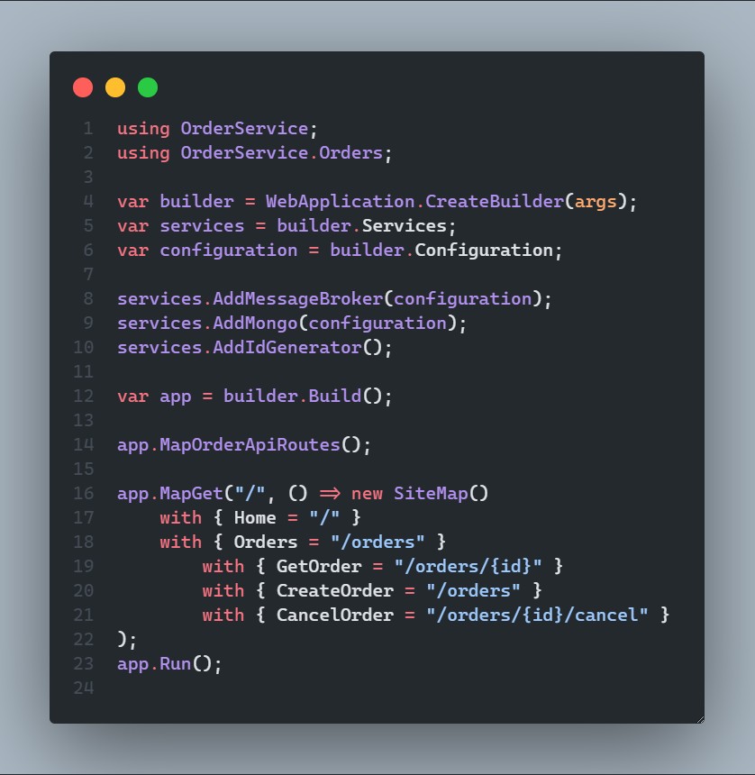
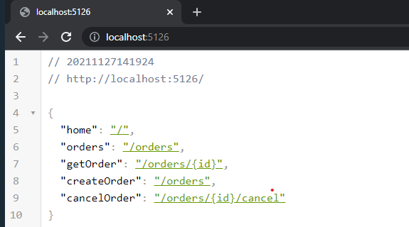
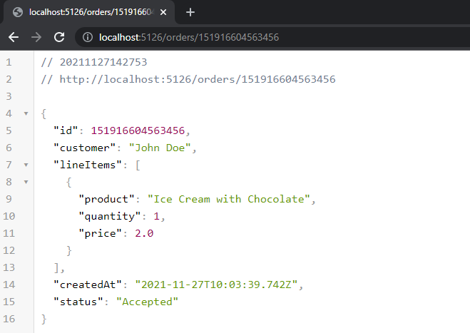
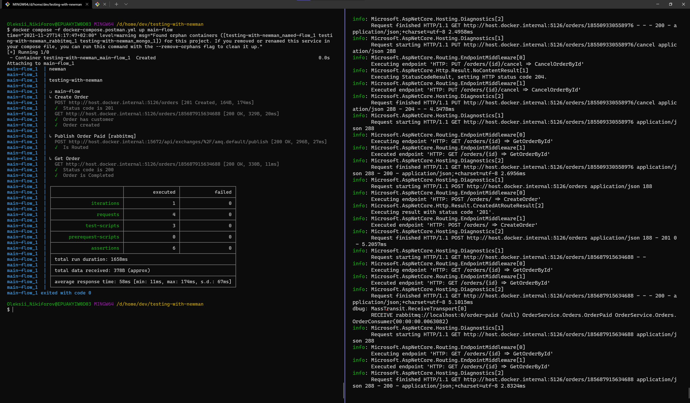
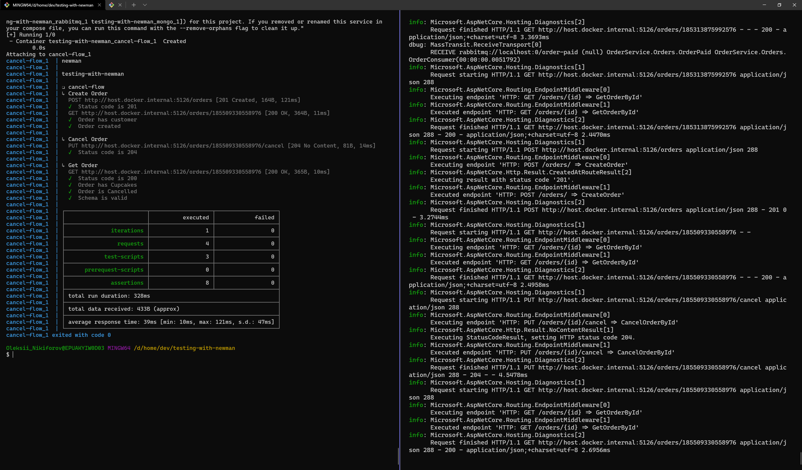

# Automatic Testing with Postman (newman) via Docker [](https://github.com/NikiforovAll/testing-with-newman-demo/actions/workflows/main.yml)

This project shows how to setup API testing with postman (newman) and `docker compose`.

## Overview

We will test very simple microservice - OrderService. It is responsible for order processing. The *MongoDB* is used as storage and *RabbitMQ* allows to complete an order once it is paid (presumably this notification event will be said by some other microservice).






## newman

See: <https://github.com/postmanlabs/newman>

Collection that is used as test run located at [testing-with-newman.postman_collection.json](tests/postman/testing-with-newman.postman_collection.json).

## Run newman from `docker compose`

```bash
docker compose -f docker-compose.postman.yml up main-flow
```



```bash
docker compose -f docker-compose.postman.yml up cancel-flow
```


